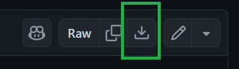
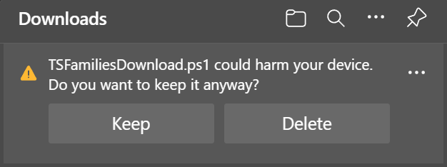
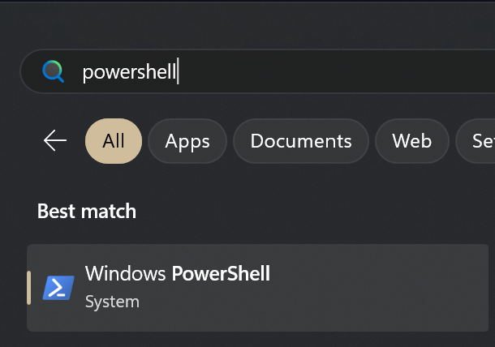

# Bulk download pictures from TS Families
This repository hosts a PowerShell script that can be used to download pictures of your dependent(s) in bulk from the Teaching Strategies Families platform (a.k.a. TS Families or "Tadpoles").

## How the script works
When the script is run, it will prompt for your TS Families username and password. After entering these, the script will log in, find your dependents, download their profile picture(s) to the directory the script is running in, and then search for all event records in the platform (starting with the current date, and going as far back as your dependent(s) were enrolled). Once this is complete, it will download all pictures found and save them under a folder with that dependent's name. Each picture will be named by the date it was taken followed by a number, so if there are multiple pictures for a day, they will be numbered (1), (2), etc...

## Downloading the script
Click on [TSFamiliesDownload.ps1](TSFamiliesDownload.ps1) (or in file list above too). Then click the Download button (top right side of file) when the script loads in the browser. After downloading, come back to this page to continue reading the instructions.



⚠️ You may get a warning when downloading that the file is potentially harmful. For this file it's ok to continue downloading, because you are knowingly downloading a script that you intend to execute.

In other scenarios, **please use extreme caution when downloading scripts**, especially if you *don't know* you're downloading a script or if someone you don't know is pressuring you (such as saying something is broken or insecure and this will "fix it"). I generally advise against downloading a script like this, but "sharing a script" is all I have time to accomplish right now.



## Make sure you can run PowerShell
### Windows
PowerShell is built into Windows, but you may have to run a couple commands to allow the script to be executed by Windows, since by default Windows does not allow downloaded scripts to be run for security reasons.

To open PowerShell:
1. Click the Start button or hit the Windows key on your keyboard.
2. Search for PowerShell and click it (or hit Enter).



3. Make sure you can execute the script - copy and paste this command into the PowerShell window to make sure it can run any script.

**NOTE**: This will only allow the *current PowerShell session* to run any script. Once the window is closed, it will revert back to default, which is more restrictive.

```
Set-ExecutionPolicy -Scope Process -ExecutionPolicy Unrestricted
```

### Mac OS
PowerShell can be installed on Mac OS by following [Microsoft's instructions](https://learn.microsoft.com/powershell/scripting/install/installing-powershell-on-macos?view=powershell-7.4).

## Running the script

1. In the PowerShell window, change the working directory to the location the script was downloaded to.

- For example, if downloaded to the standard *Downloads* location in Chrome/Edge/etc., you can copy and run this command:
    ```
    cd $env:userprofile\downloads
    ```

2. Run the script. (Make sure you followed step 3 from [Make sure you can run PowerShell](#make-sure-you-can-run-powershell) first if running on Windows)
    ```
    .\TSFamiliesDownload.ps1
    ```

- You may see a warning about executing unsafe scripts. If you do, enter "R" to run the script.
- To prevent having to enter "R" every time you run the script, you can also "unblock" the file to mark it as safe on your computer.

    ```
    Unblock-File TSFamiliesDownload.ps1
    ```

## Advanced options
Here are some optional arguments that can be specified.

- `-earliestDate <date>` (like "2024-05-01"): Instead of downloading images as far back as your dependent was enrolled, only download images as early as this date.
- `-latestDate <date>` (like "2024-05-01"): Instead of downloading images starting with the current date, only download images as old as the date specified.

## Known shortcomings
- Dependents may have images of their leftover lunch. While I understand what it would take technically to filter these out, I don't have the time to implement this, so all lunch images will be included in the bulk download.
- I'm not sure how reliably images are sorted when discovered from the service. As a result, running the script multiple times may label multiple images in the same day differently. Therefore, if the script is run again, it will overwrite all images already downloaded and download them again, and the names of the image (e.g. 2024-05-01 (1), 2024-05-01 (2), ...) may get swapped or mixed around.
  - As a result, it's safest not to interrupt the script while downloading a second time to ensure no images get overwritten with a duplicate of a different image.
  - If you just want to run it again to download new pictures that weren't available last time, I suggest using the [date range options above](#advanced-options).
- Images may have a short comment associated with them in the app/platform. These will not be included with the downloaded images.

## Have a problem or question?
Let me know by [submitting an issue](https://github.com/JohnathonMohr/ts-families-bulk-download/issues/new)!.

However, please understand I don't have much time to dedicate to this, so I may or may not be able to help.